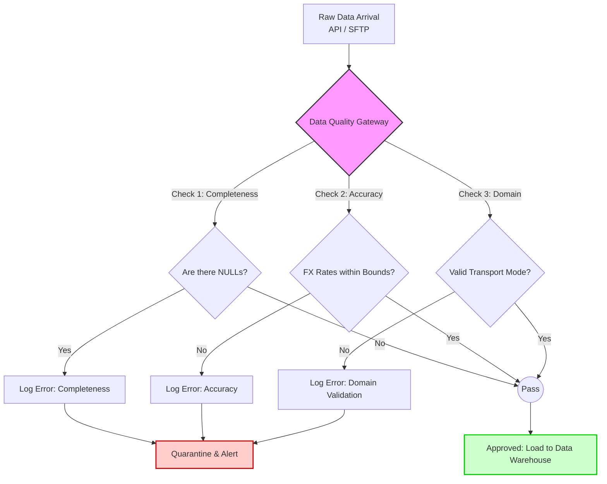

# Bloc 1: Data Governance

## Overview

This block represents the foundational Data Governance framework for the Aurora Tech MLOps project. As Aurora Tech expands its operations, specifically focusing on the production and logistics of new devices like Chromebooks, maintaining data integrity, security, and quality is paramount. This module defines the rules, dictionaries, and automated checks necessary to ensure that downstream analytical and machine learning systems receive reliable data.

## Objectives

1.  **Establish Clear Ownership:** Define who is responsible for data assets.
2.  **Define Structural Standards:** Provide a single source of truth for schemas.
3.  **Automate Quality Assurance:** Implement programmatic checks to validate data.
4.  **Ensure Regulatory Compliance:** Lay the groundwork for GDPR/CCPA compliance.

---

## 📊 Visualizing Governance Policies

### 1. Data Quality Assurance Workflow
The following diagram illustrates the automated data quality gates implemented by `data_quality_checks.py` before data is permitted to enter the data warehouse.



### 2. RACI Matrix (Data Ownership)
A clear RACI (Responsible, Accountable, Consulted, Informed) matrix ensures accountability across the data lifecycle.

| Data Asset / Process | Data Engineer | Data Scientist | Product Owner | Security Team |
| :--- | :---: | :---: | :---: | :---: |
| **Pipeline Extraction** | **R**, **A** | I | I | C |
| **Data Quality SLAs** | **R** | C | **A** | I |
| **RBAC / Access Policy** | C | I | **A** | **R** |
| **ML Feature Engineering** | C | **R**, **A** | I | I |

---

## Directory Contents

### 1. `Data_Governance_Policy.md`
The official corporate governance strategy document containing the RACI matrix, SLAs, and Role-Based Access Control (RBAC) classifications.

### 2. `data_dictionary.csv`
A comprehensive, tabular dictionary of all fields, types, and constraints present in the Aurora Tech Data Warehouse.

### 3. `data_quality_checks.py`
A Python script designed to be integrated into our ETL pipelines. It implements automated data validation based on the governance policy.

## How to Test Quality Checks Locally

Ensure you have Python installed, along with the `pandas` library.

```bash
# 1. Install dependencies
pip install pandas

# 2. Run the quality check script
python data_quality_checks.py
```
