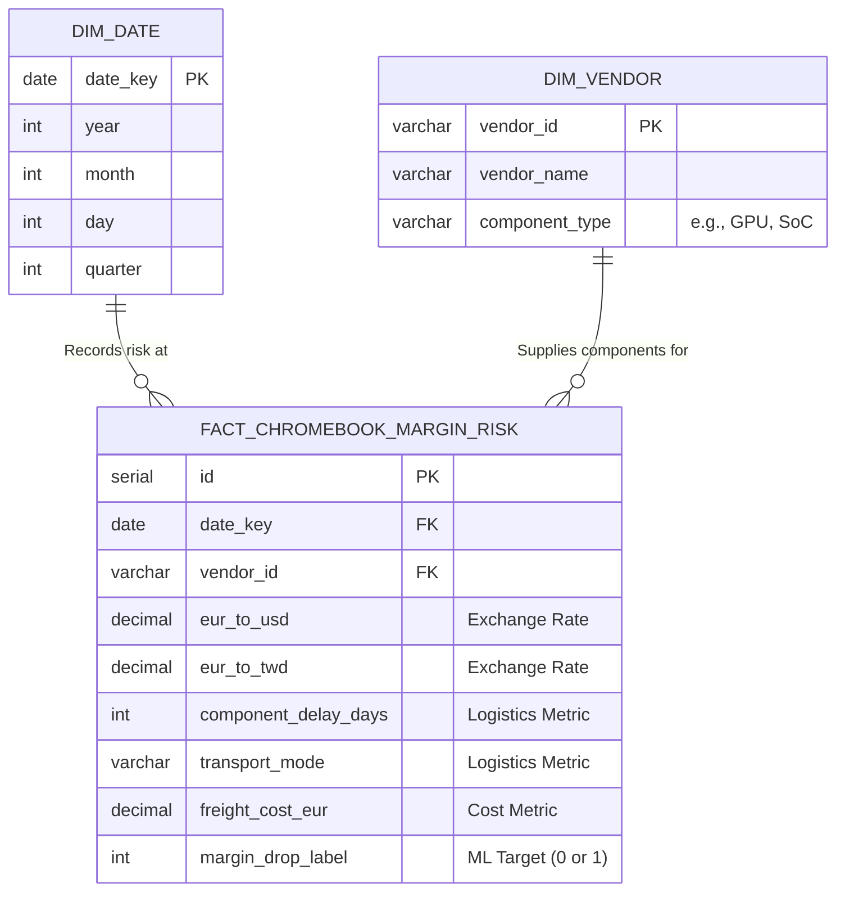
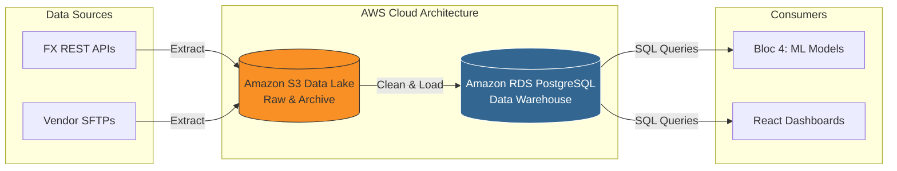

# Bloc 2: Data Architecture

## Overview

This block details the structural foundation of the Aurora Tech analytical environment. It provides both a local testing environment using Docker and PostgreSQL, as well as a strategic blueprint for cloud deployment using Terraform. 

---

## 📊 Architecture & Schemas

### 1. Star Schema Design (Data Warehouse)
The database utilizes a classic Star Schema optimized for analytical read queries and machine learning feature extraction. The central Fact table tracks margin risk, filtering dynamically through Date and Vendor Dimensions.



### 2. Cloud Infrastructure Architecture (Terraform Blueprint)
The following diagram illustrates our planned cloud architecture defined via Terraform (`main.tf`), scaling from raw data lake to refined analytical models.



---

## Directory Contents

### 1. `docker-compose.yml`
Defines the local, containerized PostgreSQL environment exposing port `5432`.

### 2. `init.sql`
The master SQL script executed to construct the **Star Schema** detailed above. It handles schema creation, table definitions, and Role-Based Access Control (RBAC).

### 3. `setup.sh`
An interactive Bash utility script that simplifies the orchestration of the local environment for developers.

### 4. `terraform/main.tf`
The IaC (Infrastructure as Code) blueprint for our AWS migration, provisioning S3, RDS, and automated lifecycle policies.

## How to Run the Local Environment

Ensure you have Docker and Docker Compose installed on your machine.

```bash
# 1. Navigate to the architecture directory
cd auroratech-repo/bloc2_architecture

# 2. Make the setup script executable (Linux/macOS)
chmod +x setup.sh

# 3. Run the setup script
./setup.sh
```
