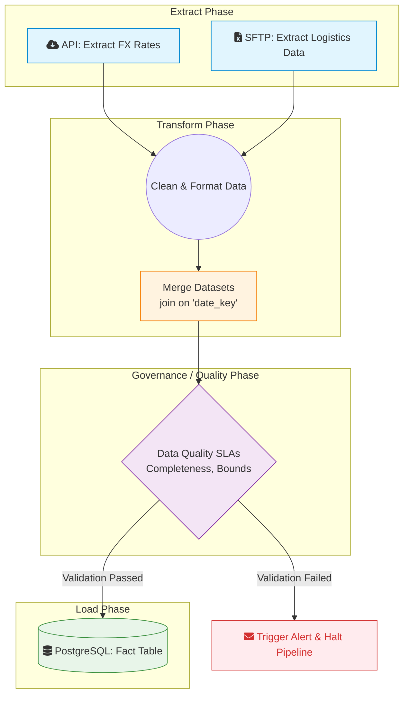

# Bloc 3: Data Pipelines

## Overview

This block focuses on the ETL (Extract, Transform, Load) processes required to populate the Aurora Tech Data Warehouse. To ensure reliability, scheduling, and monitoring, we utilize Apache Airflow as our orchestration engine.

---

## 📊 Pipeline Flow (Airflow DAG)

The pipeline is structured as a Directed Acyclic Graph (DAG) scheduled to run daily. It demonstrates the flow of disjointed data sources merging into a unified analytical asset.



---

## Directory Contents

### 1. `dags/auroratech_pipeline.py`
The core Airflow DAG file. It utilizes Python operators to define the ETL workflow.
-   Tasks are explicitly linked (`extract >> transform >> validate >> load`) to ensure execution order.

### 2. `Dockerfile`
A customized Dockerfile extending the official `apache/airflow` image.
-   Installs required OS-level build tools.
-   Installs specific Python dependencies required by our custom DAGs.

### 3. `requirements.txt`
Specifies the exact versions of the Python packages needed in the Airflow environment (`requests`, `pandas`, `apache-airflow-providers-postgres`).

## Deployment & Usage

To build the custom Airflow image locally based on our requirements:

```bash
# 1. Navigate to the pipelines directory
cd auroratech-repo/bloc3_pipelines

# 2. Build the Docker image
docker build -t auroratech-airflow-custom:latest .
```

*Note: Executing the Airflow environment locally requires a full Airflow `docker-compose` setup mapping to the `/dags` directory. The provided code represents the production-ready DAG and environment definition.*
