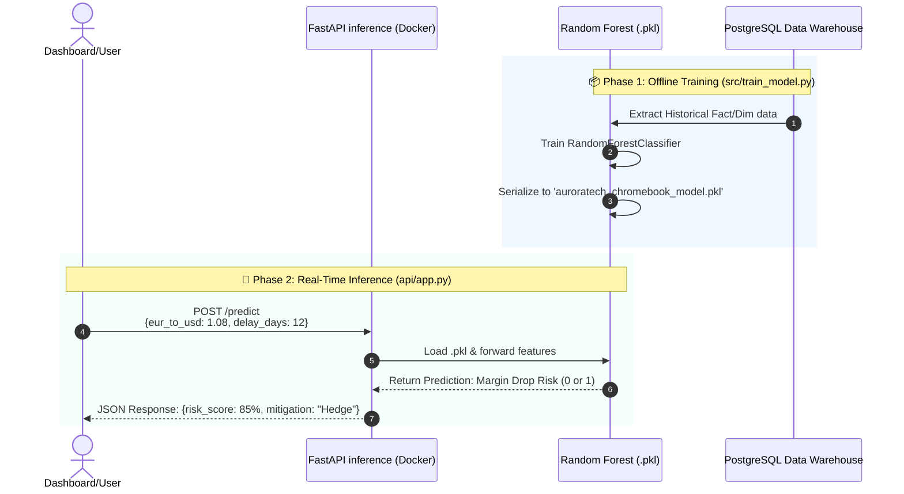

# Bloc 4: AI Solutions

## Overview

This block represents the predictive intelligence layer of the Aurora Tech MLOps project. Building upon the governed data warehouse securely populated by our pipelines, we have developed a Machine Learning model designed to predict severe margin drops in Chromebook production based on real-time FX fluctuations and vendor delays. 

---

## 📊 MLOps & Inference Architecture

### 1. Model Lifecycle & API Interaction
The diagram below illustrates how we transition from offline model training (using the Star Schema data) to real-time online inference using FastAPI.



### 2. Feature Importance Profiling
*A key benefit of using a Random Forest model is explainability. The model prioritizes features dynamically:*
-   **Highest Impact:** `eur_to_usd` ratios (Macro-economic factors)
-   **High Impact:** `component_delay_days` (Supply Chain bottlenecks)
-   **Moderate Impact:** `freight_cost_eur` and `transport_mode`

---

## Directory Contents

### 1. `src/train_model.py`
The core machine learning script. It splits data, trains a `RandomForestClassifier` via `scikit-learn`, evaluates accuracy, and serializes the trained model to disk as a `.pkl` file.

### 2. `api/app.py`
A high-performance FastAPI web service that serves the trained model exposing a POST endpoint (`/predict`). Provides structural typing via Pydantic.

### 3. `requirements.txt`
Dependencies including `scikit-learn`, `fastapi`, `uvicorn`, and `pandas`.

### 4. `Dockerfile`
Packages the FastAPI application and the serialized model into a lightweight, standalone container, ready for deployment.

### 5. `Makefile`
A utility file providing shorthand CLI commands to simplify the MLOps lifecycle for data scientists.

## How to Train and Serve Locally

Ensure you have Python 3.10+ installed.

```bash
# Navigate to the ai solutions directory
cd auroratech-repo/bloc4_ai_solutions

# 1. Install local dependencies
pip install -r requirements.txt

# 2. Train the model (Outputs metrics and generates the .pkl file)
make train

# 3. Start the FastAPI inference server
make serve
```

Once the server is running, the Swagger API testing interface is available at: `http://127.0.0.1:8000/docs`

## Docker Deployment

To build and run the encapsulated microservice:

```bash
make docker-build
make docker-run
```
